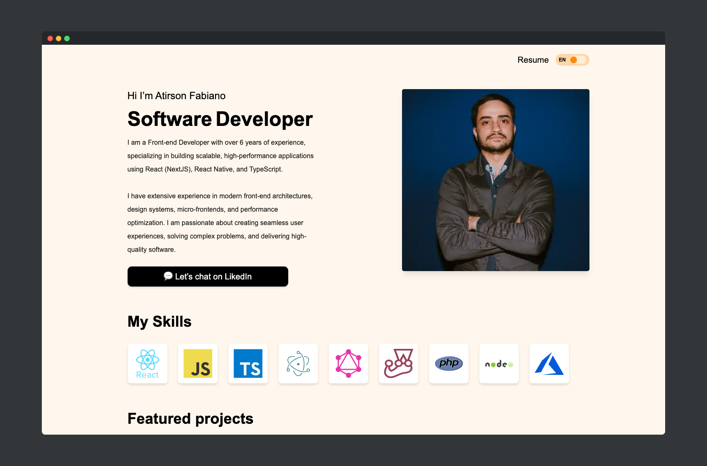
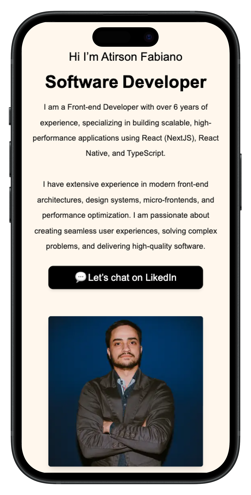

# Personal Portfolio

A clean, modern personal portfolio built with **Next.js**, **React**, **TypeScript**, **Tailwind CSS**, and internationalization support.

---

## ✨ Features

- **Modern stack:** Next.js 16, React 19, TypeScript 5
- **Styling:** Tailwind CSS 4
- **Internationalization:** next-intl (App Router compatible)
- **Data fetching:** graphql-request, GraphQL 16
- **Linting & Formatting:** ESLint 9, Biome
- **Production-ready:** Build & start scripts

---

## 🛠️ Tech Stack

| Core         | Styling         | i18n           | Data Layer      | Dev Tooling         |
|--------------|----------------|----------------|-----------------|---------------------|
|    |  |  |   |  |

---


## 📸 Screenshots

### Desktop Preview



### Mobile Preview



---

## 🚀 Getting Started

### Prerequisites

- Node.js (LTS recommended)
- pnpm, yarn, or npm

### Install

```bash
# with pnpm
pnpm install

# or with yarn
yarn

# or with npm
npm install
```

### Development

```bash
npm run dev
# or
yarn dev
# or
pnpm dev
```

### Lint

```bash
npm run lint
```

### Build and Start (Production)

```bash
npm run build
npm run start
```

---

## 📦 Available Scripts

| Script   | Description         |
|----------|---------------------|
| dev      | next dev            |
| build    | next build          |
| start    | next start          |
| lint     | eslint              |

---

## 🗂️ Project Structure (Simplified) App Folder

````shell
.
├── [locale]
│   ├── homeClient.tsx
│   ├── layout.tsx
│   └── page.tsx
├── api
│   └── contact
│       └── route.ts
├── components
│   ├── ContactForm.tsx
│   └── LanguageSwitch.tsx
├── favicon.ico
├── global.d.ts
├── globals.css
├── hooks
│   └── useAnalytics.ts
├── lib
│   ├── gtag.ts
│   └── hygraph.ts
├── og-image.png
├── page.tsx
└── services
    └── usePortfolioDetails.ts
````

---

## 🌐 Internationalization

- Configure locales and `defaultLocale` via [next-intl](https://next-intl-docs.vercel.app/docs/getting-started/app-router).
- Store translation JSON per locale in `/messages`.
- Use translation hooks in components/pages.

---

## 🔗 GraphQL Usage

- Use [graphql-request](https://github.com/jasonkuhrt/graphql-request) for simple, typed queries.
- Create a client, define queries, and fetch data in server or client components.

---

## 🎨 Styling

- [Tailwind CSS 4](https://tailwindcss.com/) utility-first classes.
- Responsive design with a mobile-first approach.

---

## 🧹 Code Quality

- ESLint with Next.js config.
- Optional: [Biome](https://biomejs.dev/) for fast formatting/linting.

---

## ☁️ Deployment

- Build: `npm run build`
- Start: `npm run start` on your host of choice (Vercel, Netlify, etc.)

---

## 📄 License

[MIT](LICENSE)

---

## 👤 Author

**Atirson Fabiano** — Personal portfolio
