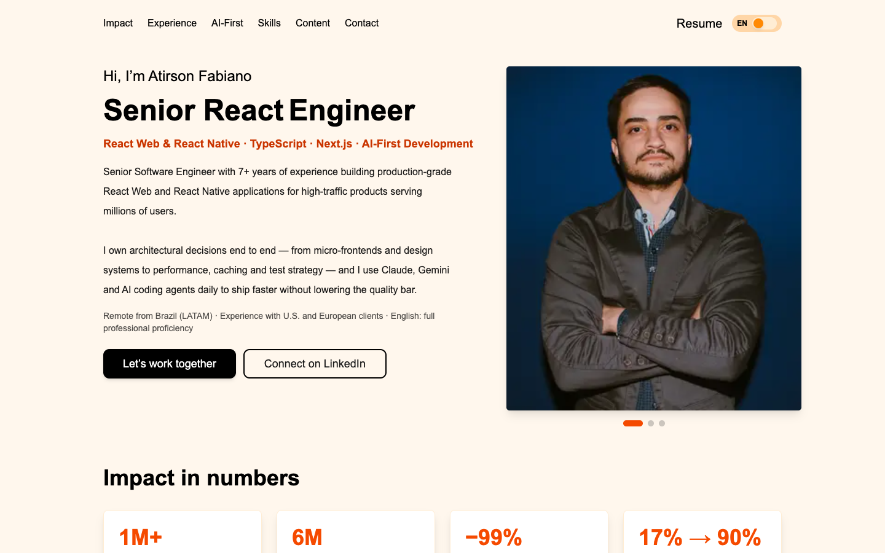
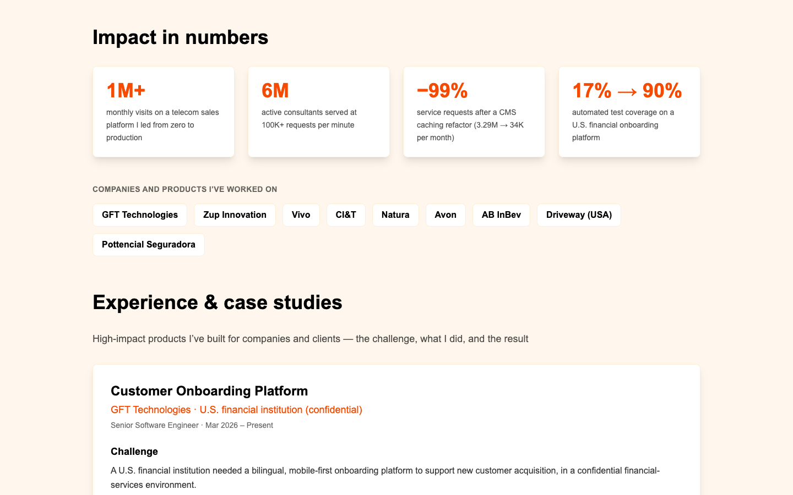
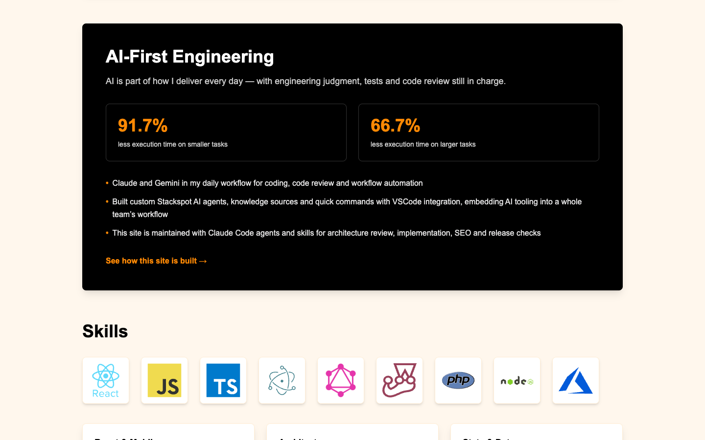
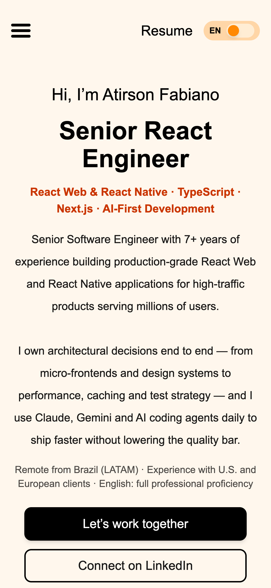
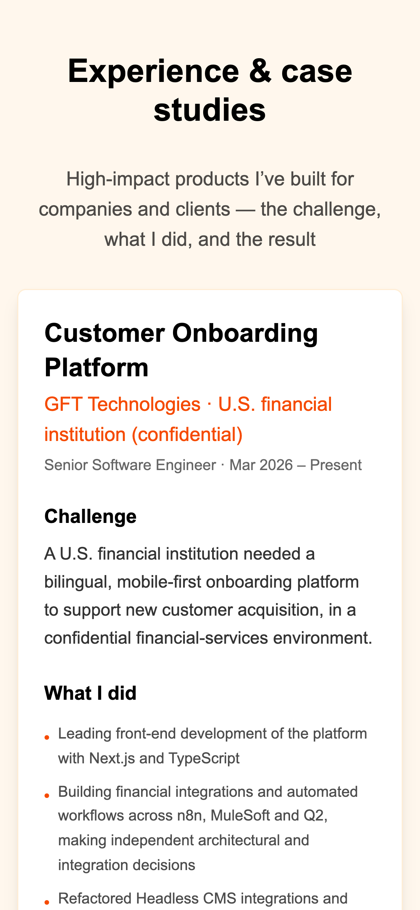

# Atirson Fabiano — Portfolio

Personal site of **Atirson Fabiano, Senior React Engineer** (React Web & React Native · TypeScript · Next.js · AI-First Development), live at **[www.atirson.com](https://www.atirson.com)**.

One Next.js 16 (App Router) deployment serves three independent surfaces:

| Route | What it is |
|---|---|
| `/en`, `/pt` | The professional portfolio, bilingual. `/` redirects to the visitor's language (`Accept-Language`). |
| `/linktree` | A link-in-bio page with a feature-flag demo powered by [`feature-flow-js`](https://www.npmjs.com/package/feature-flow-js). |
| `/ravyla-atirson` | A personal wedding page with a photo gallery (`/ravyla-atirson/galeria`). |

---

## 📸 Screenshots

### Desktop







### Mobile

<p>
  
  &nbsp;
  
</p>

---

## ✨ Features

- **Portfolio sections:** hero, impact in numbers, companies, experience & case studies (challenge → what I did → impact → stack), AI-First engineering, skills, education & languages, open-source projects, YouTube & articles, and a contact form.
- **Bilingual (en/pt):** all static copy lives in `locales/en.json` and `locales/pt.json`; a unit test keeps both files structurally identical.
- **CMS content:** open-source projects, skill icons and résumé links come from [Hygraph](https://hygraph.com/) (GraphQL).
- **SEO:** per-locale metadata with canonical and `hreflang` alternates, `Person` JSON-LD, `sitemap.xml`, `robots.txt`, and a generated Open Graph / Twitter image per locale built from the same locale copy.
- **Contact form:** `POST /api/contact` validates input, rate-limits per IP and forwards the message as an [ntfy](https://ntfy.sh/) notification.
- **Analytics:** Google Analytics 4 events for CTAs, navigation, projects, videos, articles and scroll depth.
- **Accessibility:** semantic landmarks, a keyboard-operable mobile menu, labelled form fields and a video modal that closes with <kbd>Esc</kbd>.

---

## 🛠️ Tech Stack

| Area | Tools |
|---|---|
| Framework |    |
| Styling |  |
| Data |   via `graphql-request` |
| Feature flags | `feature-flow-js` (linktree) |
| Analytics |  |
| Quality |   Node's built-in test runner |

---

## 🚀 Getting Started

### Prerequisites

- **Node.js 22.6+** (the test script uses Node's TypeScript type stripping)
- npm

### Environment variables

Copy `.env.example` to `.env` and fill it in:

| Variable | Required | Purpose |
|---|---|---|
| `NEXT_PUBLIC_HYGRAPH_ENDPOINT` | Yes | Hygraph GraphQL endpoint. The portfolio throws at request time without it. |
| `NEXT_HYGRAPH_TOKEN` | No | Hygraph auth token, if the content API is not public. |
| `NEXT_PUBLIC_ENVIRONMENT` | No | Environment name used by the linktree's local feature flags. |

### Run

```bash
npm install
npm run dev        # http://localhost:3000
```

### Production build

```bash
npm run build
npm run start
```

---

## 📦 Scripts

| Script | Command | Description |
|---|---|---|
| `dev` | `next dev` | Development server |
| `build` | `next build` | Production build |
| `start` | `next start` | Serve the production build |
| `lint` | `eslint` | ESLint (Next.js core-web-vitals + TypeScript rules) |
| `test` | `node --experimental-strip-types --test …` | Unit tests for helpers and en/pt locale parity |

Formatting and extra lint rules run through Biome: `npx biome check .`

---

## 🗂️ Project Structure

```shell
app/
├── [locale]/                 # Portfolio (en/pt)
│   ├── layout.tsx            # Metadata, canonical/hreflang, GA4
│   ├── page.tsx              # Data fetching + Person JSON-LD
│   ├── homeClient.tsx        # Page sections (client component)
│   ├── opengraph-image.tsx   # Generated social preview per locale
│   └── twitter-image.tsx
├── api/
│   ├── contact/route.ts      # Contact form → ntfy
│   └── feature-flags/route.ts# "Remote" flags for the linktree
├── components/               # ContactForm, LanguageSwitch
├── hooks/useAnalytics.ts
├── lib/
│   ├── experience.ts         # Years of experience
│   ├── locale.ts             # Accept-Language → locale
│   ├── site.ts               # Site URL and social links
│   ├── gtag.ts               # GA4 helpers
│   ├── hygraph.ts            # GraphQL client
│   ├── flag.config.ts        # Local feature flags
│   └── remote-flags.ts
├── services/usePortfolioDetails.ts  # Hygraph queries
├── linktree/                 # Link-in-bio page
├── ravyla-atirson/           # Wedding page + gallery
├── page.tsx                  # Locale redirect
├── sitemap.ts
└── robots.ts
locales/
├── en.json
└── pt.json
```

---

## 🤖 Built with AI agents

This repository is maintained with [Claude Code](https://claude.com/claude-code). The `.claude/` folder holds the project's agents and skills:

- **Agents:** `portfolio-architect`, `portfolio-developer`, `portfolio-reviewer`, `portfolio-content`, `portfolio-seo`, `portfolio-release`.
- **Skills:** `validate-portfolio`, `verify-links`, `verify-documentation`, `audit-accessibility`, `audit-performance`, `audit-seo`, `generate-project-case-study`, `generate-changelog`, `release-checklist`.

`CLAUDE.md` describes the architecture, rules and the recommended workflow between them.

---

## ☁️ Deployment

Deployed on Vercel from `npm run build`. There is no CI pipeline: run `npm run lint`, `npx tsc --noEmit`, `npm test` and `npm run build` before shipping (the `release-checklist` skill covers this).

---

## 📄 License

[MIT](LICENSE) © Atirson Fabiano
