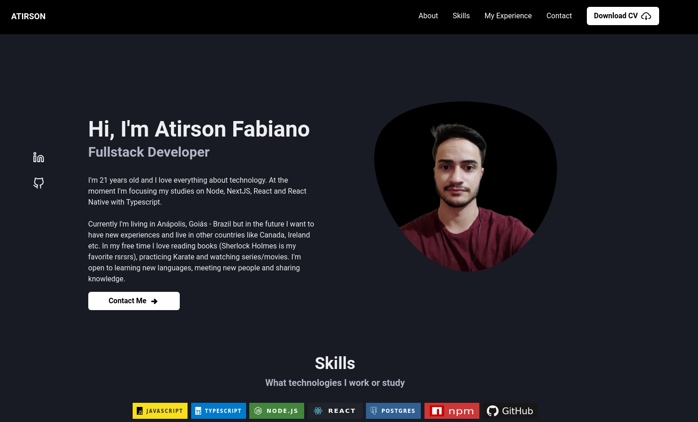

<div align="center">
  <h1>Portfolio Project</h1>
  
</div>

## Techs


<br />
This project I use different technologies to learn and show what I know and study. At page I show my resume using components of React.

<br />

**Libraries emphasis**

<ul>
  <li>React Hook Form</li>
  <li>Yup</li>
  <li>Nodemailer</li>
  <li>React Veritcal Timeline Component</li>
  <li>React Toastify</li>
</ul>

## How to install

**Dependencies**

*Node >= 14.17.0*
<br />
*Yarn >= 1.22.17*
<br />
*NPM >= 6.14.13*

Clone this repository and inside repo run:

```sh 
yarn 
```

or

```sh 
npm install
```

and run:

```sh 
yarn run dev
```

or 


```sh 
npm run dev
```

You can access the using <a href="http://localhost:3000" target="_blank">here</a> : 

```
http://localhost:3000
```